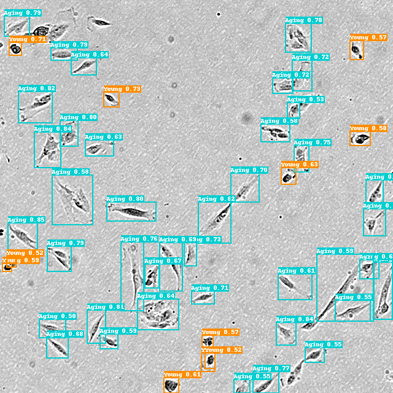

1 Code description  
  1.1: The code .yml file used has been uploaded and is in the root directory ../STGF-R-CNN/faster_rcnn_swin_tiny_fpn_gn_3x.yml 
  1.2: You need to place the faster_rcnn_swin_tiny_fpn_gn_3x.yml file in Paddle's folder ../STGF-R-CNN/config/faster_rcnn. Just copy the path when running. 
  1.3: Pay attention to version compatibility issues. The PaddleDetection version used is: 
  PaddleDetection：https://github.com/PaddlePaddle/PaddleDetection  
  full_version    = '2.4.0'  
  commit          = 'bb4fbe84252608a3bb52dc794fec10af169b5c0e'  

2 For details on the installation of Paddle, see：https://github.com/PaddlePaddle/PaddleDetection  

3 Dataset configuration file 
  ../configs/datasets/iMSC_pro_detection.yml and ../dataset/iMSC_pro 

4 Training 
   python tools/train.py -c configs/faster_rcnn/faster_rcnn_swin_tiny_fpn_gn_3x.yml -o 
   
5 test  
 

6 datasets: The dataset used in this study is private. If you are interested in our work, please contact us. 

